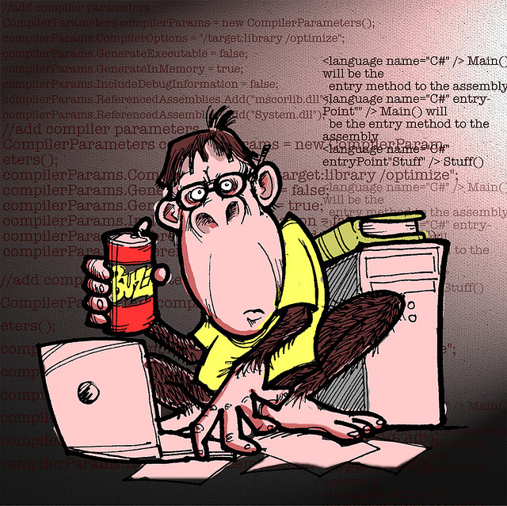

!SLIDE

# `<what>` #

!SLIDE

# version control system #

!SLIDE

    @@@Ruby
    def initialize(x = 30, y = 15)
        x = x >= 5 ? x : 5
        x += 1 unless x.odd?

        y = y >= 5 ? y : 5
        y += 1 unless y.odd?

        fill_in!(x, y)
        dig_out!
    end

    def fill_in!(x, y)
        puts "Filling in the maze..."
        @map = Array.new
        y.times { |i| @map[i] = ['#'] * x }
    end

!SLIDE 

# developers #

!SLIDE full-page-image

Image courtesy of <a rel="cc:attributionURL" href="http://www.flickr.com/photos/jawboneradio/">jawboneradio</a> <a rel="license" href="http://creativecommons.org/licenses/by-nc-sa/2.0/">(CC-BY-NC-SA)</a>

!SLIDE bullets incremental

# messy #

 * how to revert to what worked?
 * what changed?
 * how to share?

!SLIDE

# code to manage code #

!SLIDE

# manage changes in code #

!SLIDE

# maintaining history #

!SLIDE bullets incremental

# examples #

 * CSV
 * SVN
 * Mercurial
 * git

!SLIDE

# git #

!SLIDE

# 2005 #

!SLIDE

# Linus Torvalds # 

!SLIDE

# "stupid" #

!SLIDE

# `</what>` #